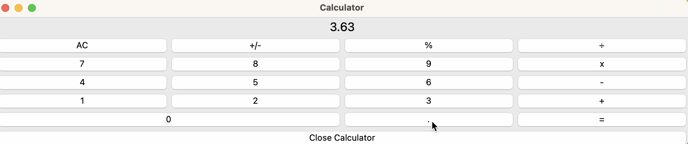

# Python Calculator App
### Tkinter used for GUI

#### I didn't want to fork over the money for a calculator, so I did this instead :laughing:

This calculator is an imitation of the native Apple [calculator app](https://en.wikipedia.org/wiki/Calculator_(Apple)).
  
See the following short user demo. 
